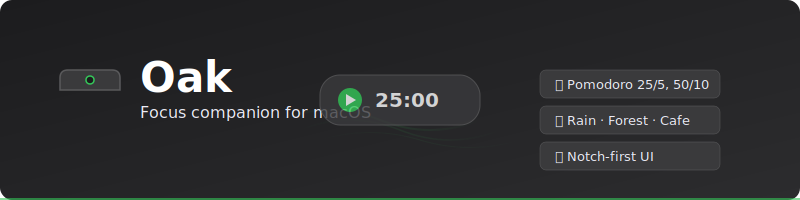

<div align="center">
  
</div>

<div align="center">

[](LICENSE)
[]()
[]()

</div>

## 🎬 Demo

<div align="center">
  
</div>

# Oak

A lightweight macOS focus companion designed for deep work.

## ✨ Features

- 🎯 **Notch-first** focus companion UI
- ⏱️ **Fixed Pomodoro** presets: `25/5` and `50/10`
- ▶️ **Session controls**: start, pause, resume
- 🎵 **Ambient sounds**: rain, forest, cafe, brown noise, lo-fi
- 📊 **Local tracking**: daily focus minutes, completed sessions, 7-day streak

## 🚀 Getting Started

### Prerequisites

- macOS 13+ (Apple Silicon recommended)
- XcodeGen (`brew install xcodegen`)
- SwiftLint (optional, for code linting: `brew install swiftlint`)
- SwiftFormat (optional, for code formatting: `brew install swiftformat`)

### Installation

```bash
# Clone the repository
git clone https://github.com/jellydn/oak.git
cd oak

# Generate Xcode project
cd Oak && xcodegen generate

# Build and run
open Oak.xcodeproj
```

### Build Commands

```bash
# Show available commands
just

# Build the project
just build

# Build release version
just build-release

# Run all tests
just test

# Run tests with verbose output
just test-verbose

# Run a specific test class
just test-class FocusSessionViewModelTests

# Run a specific test method
just test-method FocusSessionViewModelTests testStartSession

# Check for compilation errors
just check

# Clean build artifacts
just clean

# Open in Xcode
just open

# Validate bundled ambient sound files
just check-sounds
```

### Ambient Sound Assets

Oak expects bundled ambient files under `Oak/Oak/Resources/Sounds` with these base names:

- `ambient_rain`
- `ambient_forest`
- `ambient_cafe`
- `ambient_brown_noise`
- `ambient_lofi`

Supported extensions: `.m4a` (preferred), `.wav`, `.mp3`.

Sourcing options:

- Mixkit: https://mixkit.co/license/
- Pixabay: https://pixabay.com/service/license-summary/
- Freesound (check CC license/attribution per file): https://freesound.org/help/faq/

### Code Quality Commands

```bash
# Lint Swift code
just lint

# Auto-fix linting issues
just lint-fix

# Format Swift code
just format

# Check if code is formatted correctly
just format-check

# Run both lint and format checks
just check-style
```

## CI/CD and Releases

- CI runs on GitHub Actions (`.github/workflows/ci.yml`) for `push` to `main` and all PRs.
- **Auto-release** (`.github/workflows/auto-release.yml`) automatically creates a new release when changes are merged to `main`:
  - Automatically increments the patch version (e.g., `v0.1.0` → `v0.1.1`)
  - Creates a Git tag
  - Builds and publishes artifacts to GitHub Releases
- Manual release workflow (`.github/workflows/release.yml`) builds and publishes unsigned artifacts on:
  - tag push: `v*` (example: `v0.1.0`)
  - manual dispatch with a `version` input (example: `v0.1.0`)

### Create a Manual Release

If you need to create a specific version manually:

```bash
git tag v0.1.0
git push origin v0.1.0
```

The release uploads:
- `Oak-<version>.dmg`
- `Oak-<version>.zip`

### No Apple Account Notes

- Artifacts are built unsigned (`CODE_SIGNING_ALLOWED=NO`).
- The app is not notarized.
- Users will need to bypass Gatekeeper on first launch (Right-click app -> Open).

## 📁 Project Structure

```
Oak/
├── Oak/
│   ├── Models/              # Data models, enums, protocols
│   ├── Views/               # SwiftUI Views
│   ├── ViewModels/          # ObservableObject classes
│   ├── Services/            # Business logic, audio, persistence
│   ├── Resources/           # Assets, sounds, config files
│   └── OakApp.swift        # App entry point
├── Oak.xcodeproj/           # Generated by XcodeGen
├── project.yml              # XcodeGen config (project definition)
└── Tests/                   # Unit tests
```

**Note**: This project uses [XcodeGen](https://github.com/yonaskolb/XcodeGen) for project management. The Xcode project is generated from `project.yml`. Do not use Swift Package Manager (`swift build` or `swift test`) for this project.

## 📝 Documentation

- [PRD](tasks/prd-macos-focus-companion-app.md) - Product Requirements Document
- [Architecture Decisions](doc/adr/) - ADRs for key technical decisions
- [Agent Guidelines](AGENTS.md) - Development guidelines for contributors

## 🤝 Contributing

Contributions are welcome! Please read our contributing guidelines before submitting PRs.

## 📜 License

This project is licensed under the MIT License - see the [LICENSE](LICENSE) file for details.

## 👤 Author

**Dung Huynh**

- Website: [https://productsway.com](https://productsway.com)
- Twitter: [@jellydn](https://twitter.com/jellydn)
- GitHub: [@jellydn](https://github.com/jellydn)

## 💖 Support

[](https://ko-fi.com/dunghd)
[](https://paypal.me/dunghd)
[](https://www.buymeacoffee.com/dunghd)
