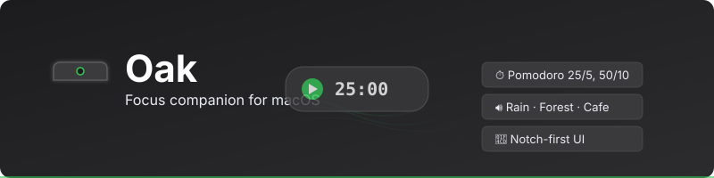

<h1 align="center">Welcome to Oak 👋</h1>

<!-- ALL-CONTRIBUTORS-BADGE:START - Do not remove or modify this section -->

[](#contributors-)

<!-- ALL-CONTRIBUTORS-BADGE:END -->

<p align="center">
  <strong>Oak</strong> is a lightweight macOS focus companion designed for deep work with notch-first UI and ambient sounds.
</p>

<div align="center">

[](LICENSE) []() []()

</div>

<div align="center">
  
</div>

## 🎬 Demo

<div align="center">
  
</div>

## Installation Requirements

- macOS 13+ (Apple Silicon recommended)

> [!IMPORTANT] > **First Launch Security Warning**
>
> Oak is not yet signed with an Apple Developer certificate. macOS may show a warning that the app cannot be opened.
>
> **Quick Fix**: Right-click the app → select **Open** → click **Open** in the dialog.
>
> For detailed instructions and alternative methods, see [TROUBLESHOOTING.md](TROUBLESHOOTING.md).

## Motivation

In today's world of constant distractions, deep work has become increasingly rare and valuable. Oak was created to help you reclaim your focus and establish productive work sessions without cluttering your screen. By leveraging the MacBook's notch area, Oak provides a subtle, always-visible timer that keeps you accountable without being intrusive.

## Features

- 🎯 **Notch-first UI**: Elegant focus companion that lives in your MacBook's notch
- ⏱️ **Pomodoro presets**: Default `25/5` and `50/10` sessions (fully configurable)
- 🔄 **Smart breaks**: Automatic 15/20 min long breaks after 4 focus rounds
- ▶️ **Session controls**: Start, pause, and resume your focus sessions
- 🎵 **Sound library**: Use the built-in ambient sounds or import your own local audio files
- ⌨️ **Keyboard shortcuts**: Press Space to start/pause/resume, Escape to reset — control sessions without touching the mouse
- 📊 **Local tracking**: Track daily focus minutes, completed sessions, and 7-day streaks
- 🕒 **Session timeline**: See each focus session and break from today with start/end times and durations
- 💾 **Data export**: Export your progress as JSON or CSV, or import from a backup file
- 🎨 **Themes**: Choose Oak, Kanagawa, Dracula, Tokyo Night, or their light variants in Settings
- 🔄 **Auto-update**: Seamless updates via Sparkle framework

### Theme palettes

Oak follows the official [Kanagawa Wave and Lotus](https://github.com/rebelot/kanagawa.nvim),
[Dracula and Alucard](https://github.com/dracula/dracula-theme), and
[Tokyo Night Moon and Day](https://github.com/folke/tokyonight.nvim) palettes. Alucard is Dracula's official
open-source light counterpart, so Oak labels it “Alucard (Dracula Light).” Where an editor token has insufficient
contrast in Oak's compact controls, Oak uses a stronger token from the same palette. Dracula's error red is minimally
brightened because its canonical red does not reach 3:1 against the canonical current-line surface.

### Finding sounds to import

Check the license shown for each file before you download it. Terms can change, and Oak does not track attribution
for imported sounds.

- [Pixabay Sound Effects](https://pixabay.com/sound-effects/) — Pixabay's
  [Content License](https://pixabay.com/service/license-summary/) permits free use without attribution. It prohibits
  standalone resale or redistribution and warns that third-party rights can still apply.
- [Mixkit Sound Effects](https://mixkit.co/free-sound-effects/) — Mixkit states that its free sound effects can be
  used in personal and commercial projects without attribution. Confirm that the item uses the **Sound Effects Free
  License** on the [Mixkit license page](https://mixkit.co/license/).
- [Freesound](https://freesound.org/browse/) — licenses vary by file. Prefer **CC0** for the fewest restrictions.
  **CC BY** requires creator attribution, and **CC BY-NC** also prohibits commercial use. See Freesound's
  [license and attribution guide](https://freesound.org/help/faq/#licenses).

## Installation

### Using Homebrew (Recommended)

```bash
# Add the tap
brew tap jellydn/oak https://github.com/jellydn/oak

# Install Oak
brew install --cask oak
```

### From Source

See [DEVELOPMENT.md](DEVELOPMENT.md) for detailed build instructions and development setup.

## Auto-Update

Oak uses the [Sparkle framework](https://sparkle-project.org/) to provide automatic updates:

- **Automatic update checks**: Enable/disable in Settings (enabled by default)
- **Automatic downloads**: Enable/disable in Settings (disabled by default)
- **Manual check**: Check for updates on demand via Settings

For more details about the update system, see [RELEASES.md](RELEASES.md).

## 📝 Documentation

- [TROUBLESHOOTING.md](TROUBLESHOOTING.md) - Common issues and solutions (Gatekeeper warnings, etc.)
- [DEVELOPMENT.md](DEVELOPMENT.md) - Build commands and development setup
- [RELEASES.md](RELEASES.md) - CI/CD pipeline and release process
- [PRD](tasks/prd-macos-focus-companion-app.md) - Product Requirements Document
- [Architecture Decisions](doc/adr/) - ADRs for key technical decisions
- [Agent Guidelines](AGENTS.md) - Development guidelines for contributors

## 🤝 Contributing

Contributions are welcome! Please read our contributing guidelines before submitting PRs.

## 📜 License

This project is licensed under the MIT License - see the [LICENSE](LICENSE) file for details.

## Author

👤 **Dung Huynh**

- Website: [https://productsway.com](https://productsway.com)
- Twitter: [@jellydn](https://twitter.com/jellydn)
- GitHub: [@jellydn](https://github.com/jellydn)

## Show your support

Give a ⭐️ if this project helped you!

[](https://ko-fi.com/dunghd) [](https://paypal.me/dunghd) [](https://www.buymeacoffee.com/dunghd)

## Contributors ✨

Thanks goes to these wonderful people:

<!-- ALL-CONTRIBUTORS-LIST:START - Do not remove or modify this section -->
<!-- prettier-ignore-start -->
<!-- markdownlint-disable -->
<!-- markdownlint-restore -->
<!-- prettier-ignore-end -->

<!-- ALL-CONTRIBUTORS-LIST:END -->

This project follows the [all-contributors](https://github.com/all-contributors/all-contributors) specification. Contributions of any kind welcome!
